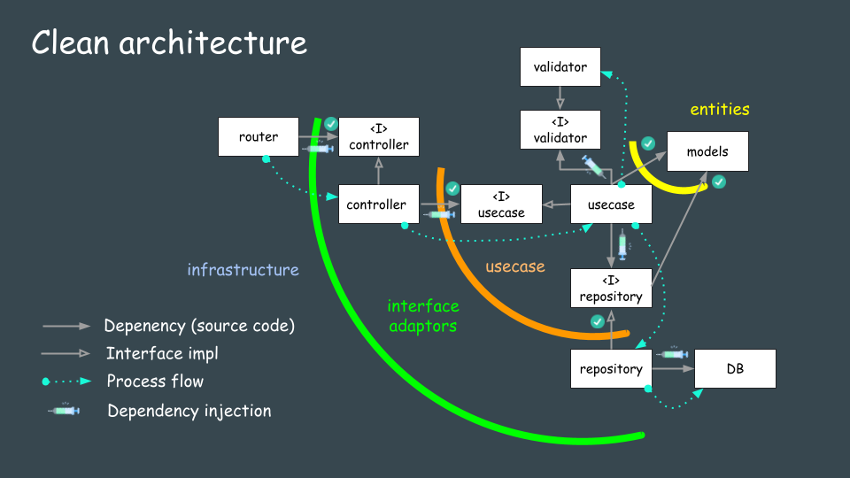

``` bash
# create module
go mod init go-rest-api
# start db
docker compose up -d
# remove db
docker compose rm -s -f -v
# start app
GO_ENV=dev go run .
# run migrate
GO_ENV=dev go run migrate/migrate.go
```
<h2 id="architecture">Architecture of REST API (Go/Echo) application</h2>




```sh
# 実行
GO_ENV=dev go run main.go
```

http://localhost:8080/tasks

トークンがない場合は、401 UnAuthorizedになってしまう
```json
{
    "message": "missing or malformed jwt"
}
```

なので、一旦ログインしてみる
http://localhost:8080/login
```json
{
    "email": "user1@example.com",
    "password": "dummypw"
}
```

POST
http://localhost:8080/tasks
```json
{
    "title": "hello"
}
```

これを実行したら下記が生成された様子
```json
{
    "id": 1,
    "title": "hello",
    "created_at": "2024-07-26T22:15:07.143502+09:00",
    "updated_at": "2024-07-26T22:15:07.143502+09:00"
}
```

GET
http://localhost:8080/tasks/2
```json
{
    "id": 2,
    "title": "hello",
    "created_at": "2024-07-26T22:16:40.894689+09:00",
    "updated_at": "2024-07-26T22:16:40.894689+09:00"
}
```

PUT
http://localhost:8080/tasks/2
```json
{
  "title": "updated"
}
```

更新後
```json
{
    "id": 2,
    "title": "updated",
    "created_at": "2024-07-26T22:16:40.894689+09:00",
    "updated_at": "2024-07-26T22:19:28.073326+09:00"
}
```

DELETE
http://localhost:8080/tasks/2

204No Content
が返ってくる

ログアウト処理
POST
http://localhost:8080/logout
これをやると、トークンが消える

そのご、残っているtasks/1でDELETEしようとすると、、、
JWTがないため、401 UnAuthorizedとなる

```json
{
    "message": "missing or malformed jwt"
}
```


http://localhost:8080/logout
http://localhost:8080/login
http://localhost:8080/signup


次は、DIでValidateion機能を追加する

```sh
go build -tags netgo -ldflags '-s -w' -o app
    && go run migrate/migrate.go
```